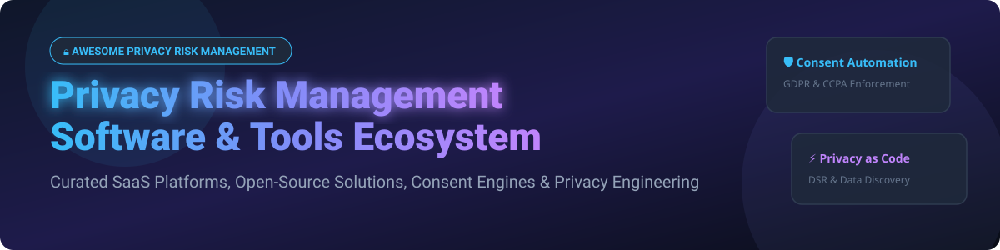

# 🛡️ Awesome Privacy Risk Management Software & Tools Ecosystem 🔒

  

  
  
  
  

**A comprehensive, curated list of enterprise SaaS platforms and open-source software for Privacy Risk Management, Privacy Engineering, Data Subject Access Requests (DSAR/DSR), Cookie Consent Management, Governance Risk & Compliance (GRC), and Regulatory Compliance (GDPR, CCPA, CPRA, HIPAA, LGPD, ISO 27701).** 🚀

*Last updated: October 2026* 📅

---

## 📚 Table of Contents
- [📊 Market Overview & Industry Structure](#-market-overview--industry-structure)
- [🏢 SaaS & Hosted Platforms](#-saas--hosted-platforms)
- [🔓 Open-Source GitHub Projects](#-open-source-github-projects)
- [🤝 How to Contribute](#-how-to-contribute)
- [📈 Star History](#-star-history)
- [💖 Support & Sponsorship](#-support--sponsorship)
- [⚠️ Disclaimer](#%EF%B8%8F-disclaimer)

---

## 📊 Market Overview & Industry Structure

> 💡 **Market Size & Fragmentation:**  
> The global **Privacy Risk Management Software** market is valued at approximately **$3.2 Billion (2026)** and is projected to expand at a compound annual growth rate (CAGR) of over **28.5%**, reaching **$11.8 Billion by 2030**.  
> The sector is currently **moderately fragmented**: mega-cap tech giants (Microsoft) and market category leaders (OneTrust, BigID) command significant market share in enterprise data discovery and compliance suite solutions, while high-growth specialized platforms (Transcend, DataGrail, Ketch) and innovative open-source frameworks (Fides, CISO Assistant) rapidly capture developer-centric and privacy-engineering segments.

---

## 🏢 SaaS & Hosted Platforms

The table below lists top enterprise SaaS platforms sorted by company scale (estimated valuation or annual revenue in descending order).

| Rank | Platform Name 🌐 | Company Size / Valuation / Revenue 💰 | Starting Paid Pricing 🏷️ | Free Tier / Free Trial Limits 🎁 | Key Privacy Capabilities ⚙️ |
| :---: | :--- | :--- | :--- | :--- | :--- |
| **1** | **[Microsoft Priva](https://www.microsoft.com/en-us/security/business/privacy)** | **~$3.1 Trillion** (Market Cap) | **$5.00** per user/month (Subject Rights Requests: **$1,400** per 10 requests/month package) | **90-Day Free Trial** (Includes full Priva Risk & Subject Rights features for up to 300 users) | Privacy risk assessments, automated DSAR fulfillment, M365 Purview data governance. |
| **2** | **[OneTrust Privacy](https://www.onetrust.com/)** | **~$4.5 Billion** (Valuation) / **~$500M+** ARR | **$400.00** / month (Consent Management starting tier) | **14-Day Free Trial** (Full access to Cookie Consent and Privacy Notice builders) | Enterprise privacy automation, cookie consent management, data mapping, vendor risk. |
| **3** | **[BigID Privacy](https://bigid.com/)** | **~$1.25 Billion** (Valuation) / **~$100M+** ARR | **$1,500.00** / month (Base Cloud instance tier) | **30-Day Free Trial** (Sandbox workspace with up to 5 target data source integrations) | ML-driven data discovery, PII classification, privacy risk scoring, DSAR automation. |
| **4** | **[Securiti](https://securiti.ai/)** | **~$1.0 Billion** (Valuation) / **~$75M+** ARR | **$250.00** / month (Privacy Center starter plan) | **14-Day Free Trial** (Free Sandbox environment for web scanner & consent module) | Data Command Center, unified security, AI-powered privacy compliance & governance. |
| **5** | **[TrustArc](https://trustarc.com/)** | **~$500 Million** (Est. Valuation) / **~$70M+** ARR | **$350.00** / month (Individual assessment module) | **14-Day Free Trial** (Access to Privacy Assessment Manager template suite) | Privacy program assessment, assurance certifications, regulatory intelligence. |
| **6** | **[Transcend](https://transcend.io/)** | **~$400 Million** (Valuation) / **~$30M+** ARR | **$790.00** / month (Data Privacy Infrastructure plan) | **30-Day Free Trial** (Includes automated data mapping & DSAR webhooks for 3 integrations) | Automated data subject request (DSR) orchestration, telemetry consent, siloless privacy. |
| **7** | **[DataGrail](https://www.datagrail.io/)** | **~$300 Million** (Valuation) / **~$25M+** ARR | **$500.00** / month (Growth tier package) | **14-Day Free Trial** (Live demonstration & integration scanning for up to 10 SaaS apps) | Automated data map creation across 2,000+ integrations, DSAR request fulfillment. |
| **8** | **[Ketch](https://www.ketch.com/)** | **~$200 Million** (Valuation) / **~$15M+** ARR | **$300.00** / month (Essential Privacy tier) | **Free Forever Tier** (10,000 monthly active users / web sessions consent collection limit) | Programmatic consent collection, backend privacy enforcement, identity resolution. |
| **9** | **[MineOS](https://www.mineos.ai/)** | **~$150 Million** (Valuation) / **~$12M+** ARR | **$149.00** / month (Starter plan) | **Free Forever Tier** (Up to 10 DSAR requests/month & 2 data source integrations) | AI-assisted data governance, smart data mapping, automated DSAR handling. |
| **10** | **[WireWheel](https://wirewheel.io/)** | **~$100 Million** (Est. Valuation) / **~$10M+** ARR | **$299.00** / month (Trust Access tier) | **14-Day Free Trial** (Subject Rights Intake portal demo with 5 template workflows) | Data Subject Access Portal, Vendor Risk Management, Privacy Impact Assessments (PIA/DPIA). |

---

## 🔓 Open-Source GitHub Projects

Open-source privacy engineering, consent engines, and GRC tools sorted strictly by **GitHub Star Count (descending)**. 🌟

| Rank | Project Name & Repository 📦 | GitHub Stars ⭐ | License 📜 | Focus & Description 📝 |
| :---: | :--- | :---: | :---: | :--- |
| **1** | **[OpenMetadata](https://github.com/open-metadata/OpenMetadata)** |  | `Apache-2.0` | **End-to-End Data Governance & PII Classification Platform** — Unified metadata management, data lineage, automated PII tagging, and privacy compliance tracking across data stacks. |
| **2** | **[DataHub](https://github.com/datahub-project/datahub)** |  | `Apache-2.0` | **Extensible Data Governance & Privacy Discovery Engine** — Built by LinkedIn; provides metadata search, dataset sensitivity tagging, data ownership tracking, and privacy risk monitoring. |
| **3** | **[Amundsen](https://github.com/amundsen-io/amundsen)** |  | `Apache-2.0` | **Data Discovery & Metadata Engine** — Originally created by Lyft; inspects schema metadata, tags sensitive PII fields, and aids regulatory audit workflows. |
| **4** | **[CISO Assistant](https://github.com/intuitem/ciso-assistant-community)** |  | `AGPL-3.0` | **All-in-One Open-Source GRC & Privacy Risk Platform** — Supports 130+ global frameworks (GDPR, HIPAA, ISO 27001, NIS2, DORA) with automatic control mapping and risk evaluation. |
| **5** | **[Apache Atlas](https://github.com/apache/atlas)** |  | `Apache-2.0` | **Enterprise Data Governance & Privacy Catalog** — Scalable governance framework for Hadoop/Spark ecosystem with metadata management, security policies, and privacy data masking. |
| **6** | **[Probo](https://github.com/getprobo/probo)** |  | `ISC` | **AI-Native GRC & Privacy Management Platform** — Built for engineering teams; includes 270+ MCP tools for AI agents, DPIA/TIA assessments, SAR/erasure request tracking, and vendor risk. |
| **7** | **[Fides (Ethyca)](https://github.com/ethyca/fides)** |  | `Apache-2.0` | **The Leading Open-Source Privacy Engineering Platform** — "Privacy as Code" for DSAR automation, automated data discovery across databases, and policy enforcement in code. |
| **8** | **[PILLAR](https://github.com/stfbk/pillar)** |  | `MIT` | **AI-Powered Privacy Threat Modeling Tool (LINDDUN Framework)** — Uses LLMs to identify privacy threats from application descriptions, data flow diagrams (DFDs), and LINDDUN GO simulations. |
| **9** | **[OpenFGC](https://github.com/wso2/openfgc)** |  | `Apache-2.0` | **Fine-Grained Consent Engine by WSO2** — Developer framework in Go for consent purposes, consent elements, full lifecycle management (Active/Revoked), and audit logging. |
| **10** | **[Conzent OCI](https://github.com/conzent-net/oci)** |  | `GPL-3.0` | **Cookie Consent & Privacy Compliance Engine** — Headless Chromium scanner, cookie categorization, IAB TCF v2.2/v2.3 support, Google Consent Mode v2, and consent logging. |
| **11** | **[KafkaCode](https://github.com/nikhil-kapu/kafkacode)** |  | `MIT` | **Local-First PII Scanner & Privacy Risk Detector CLI** — Scans source code for PII leaks, hardcoded credentials, assigns privacy grades (A+ to F), and generates SARIF/JSON reports for CI/CD. |
| **12** | **[OpenOptOut](https://github.com/rlnunez/OpenOptOut)** |  | `GPL-3.0` | **Distributed Data Broker Opt-Out & Personal Data Removal Platform** — Zero-knowledge identity vaults, consortium ILS routing, and automated opt-out dispatch for institutional privacy. |
| **13** | **[PrivaShield](https://github.com/Nehil1984/PrivaShild)** |  | `Apache-2.0` | **GDPR Compliance Management Platform** — Built for EU/German GDPR requirements; manages processing activity records (VVT), DPAs (AVV), DPIAs (DSFA), and data breaches. |

---

## 🤝 How to Contribute

We welcome contributions from privacy engineers, security compliance managers, and open-source developers! ✨

1. **Fork** the repository. 🍴
2. Add or update tool details in `README.md` following the standard table structure. 📝
3. Submit a **Pull Request** with a brief summary of the proposed addition. 🚀

Check out our curated list meta-repository: 

---

## 📈 Star History

---

## 💖 Support & Sponsorship

If you find this privacy risk management curated directory helpful in building privacy engineering workflows, ensuring regulatory compliance, or selecting software, please consider supporting the project:

- 🌟 **Star** this repository on GitHub.
- 🔄 **Fork** and share with fellow Privacy Engineers, DPOs, and CISOs.
- ☕ **Buy Me a Coffee**: Support ongoing open-source repository maintenance via [GitHub Sponsors](https://github.com/sponsors/ishandutta2007).

---

## ⚠️ Disclaimer

- This directory is a **community-curated list** provided for educational and informational research purposes only. ℹ️
- Enterprise privacy tools handle sensitive personal data (PII/PHI). Self-hosted platforms require proper security hardening, encryption, and access controls. 🔒
- Always consult legal counsel to ensure your organization complies with jurisdiction-specific privacy laws (**GDPR, CCPA/CPRA, LGPD, PIPEDA, POPIA**). ⚖️

---

  <b>Built with ❤️ for Privacy Engineers, Data Protection Officers, CISOs, & Open-Source Advocates.</b>

